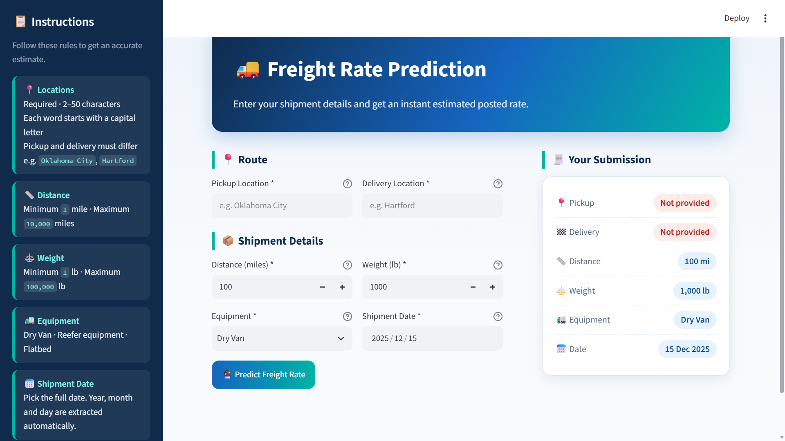
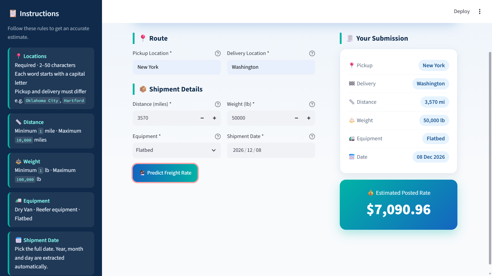
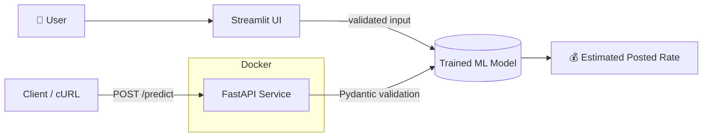
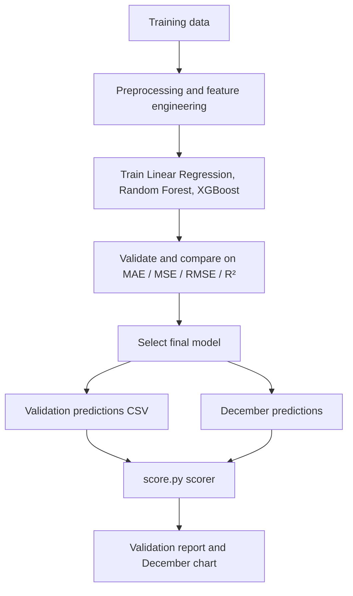

<div align="center">

# 🚚 Freight Rate Predictor

**An end-to-end machine learning system that estimates freight posted rates in real time.**

[](https://freight-rate-predictor.streamlit.app/)
[](https://hub.docker.com/r/tyhan55/freight-rate-api)
[](https://www.python.org/)
[](https://fastapi.tiangolo.com/)
[](https://scikit-learn.org/)

[🎥 Video Walkthrough](#-video-walkthrough) · [🌐 Live Demo](https://freight-rate-predictor.streamlit.app/) · [📸 Screenshots](#-screenshots) · [🚀 Quick Start](#-quick-start) · [📡 API](#-api-reference)

</div>

---

## 🎥 Video Walkthrough

<div align="center">

<a href="https://www.loom.com/share/YOUR_LOOM_VIDEO_ID" target="_blank">
  
</a>

**▶️ [Watch the full project walkthrough on Loom](https://www.loom.com/share/YOUR_LOOM_VIDEO_ID)**
 
*A guided tour of the problem, the data, the modeling approach, the API, and the live app.*
 
</div>
---

## 🎯 Overview

Freight pricing is volatile and depends on distance, load weight, equipment type, and timing. This project turns those inputs into an **instant estimated posted rate**, so shippers, brokers, and carriers can sanity-check a quote in seconds.

It covers the full lifecycle of an ML product, not just a notebook:

| Stage | What was built |
|-------|----------------|
| **Data & modeling** | Preprocessing, feature engineering, and comparison of multiple regression models |
| **Serving** | A FastAPI REST service with Pydantic validation |
| **User interface** | A Streamlit web app with input validation and a live submission summary |
| **Deployment** | Docker image on Docker Hub and a hosted Streamlit app |
| **Evaluation** | A scoring script that validates predictions and generates a December forecast chart |

### ✨ Highlights

- ⚡ **Real-time predictions** through a REST API and a web UI
- 🛡️ **Layered input validation** (UI rules and Pydantic schemas)
- 🐳 **One-command deployment** with Docker
- 📊 **Multi-model comparison** (Linear Regression, Random Forest, XGBoost)
- 📑 **Reproducible pipeline** with a scorer and documented assessment report

---

## 🌐 Live Demos

| Service | Link | Notes |
|---------|------|-------|
| 🖥️ **Web App (Streamlit)** | **[freight-rate-predictor.streamlit.app](https://freight-rate-predictor.streamlit.app/)** | No installation required |
| 🐳 **API Container (Docker Hub)** | **[tyhan55/freight-rate-api](https://hub.docker.com/r/tyhan55/freight-rate-api)** | `docker pull tyhan55/freight-rate-api:latest` |
| 📖 **API Docs (local)** | `http://localhost:8000/docs` | Swagger UI once the API is running |

> 💡 Hosted Streamlit apps can go to sleep after inactivity. If the page asks you to wake it up, click the button and give it a few seconds.

---

## 📸 Screenshots

### 1. Home page: enter shipment details

The form guides the user with in-app instructions and a live **Your Submission** summary that updates as fields change.

<p align="center">
  
</p>

### 2. Prediction result: instant estimated rate

After validation, the app shows the submission summary alongside the **Estimated Posted Rate**.

<p align="center">
  
</p>

**Example run:** New York → Washington · 3,570 mi · 50,000 lb · Flatbed · 08 Dec 2026 → **$7,090.96**

---

## 🏗️ Architecture



### Training and evaluation pipeline



---

## 🤖 Modeling Approach

Three regression algorithms were trained and compared:

| Model | Role |
|-------|------|
| **Linear Regression** | Interpretable baseline |
| **Random Forest Regressor** | Non-linear ensemble of decision trees |
| **XGBoost Regressor** | Gradient-boosted trees |

**Evaluation metrics:** MAE, MSE, RMSE, and R². The final model was chosen on validation performance, generalization, and suitability for freight-rate prediction.

<!-- TODO: fill in your real numbers from the notebook -->
| Model | MAE | RMSE | R² |
|-------|-----|------|----|
| Linear Regression | 146.16 | 538.09 |  0.8646 |
| Random Forest | 144.21 | 572.69 | 0.8466 |
| XGBoost | 124.64 | 548.20 |  0.8595 |


## 📊 Dataset & Features

| Feature | Description | Type |
|---------|-------------|------|
| `load_id` | Unique identifier for each load | Identifier |
| `pickup` / `delivery` | Origin and destination | Categorical |
| `pickup_lat`, `pickup_lon` | Pickup coordinates | Numerical |
| `delivery_lat`, `delivery_lon` | Delivery coordinates | Numerical |
| `distance` | Freight distance (miles) | Numerical |
| `equipment` | Dry Van, Reefer, or Flatbed | Categorical |
| `weight` | Load weight (lb) | Numerical |
| `date` | Load date (year, month, day extracted) | Temporal |
| `market_index` | Market-related signal | Numerical |
| `quote_signal` | Quote-related signal | Numerical |
| **`posted_rate`** | **Target: freight rate ($)** | Numerical |

---

## 🛠️ Tech Stack

| Layer | Technologies |
|-------|--------------|
| **Machine learning** | scikit-learn, XGBoost, Random Forest, Linear Regression |
| **Data processing** | Pandas, NumPy |
| **Visualization** | Matplotlib, Seaborn |
| **Backend API** | FastAPI, Uvicorn, Pydantic |
| **Frontend** | Streamlit |
| **Deployment** | Docker (Python 3.11 slim), Docker Hub, Streamlit Community Cloud |

---

## 📁 Project Structure

```text
Freight-Rate-Predictor/
├── app/
│   ├── main.py                       # FastAPI entry point
│   └── models.py                     # Pydantic request/response schemas
├── data/
│   ├── train_test.csv                # Training and testing data
│   ├── validation.csv                # Validation dataset
│   ├── december_chart_inputs.csv     # December prediction inputs
│   └── validation_predictions_template.csv
├── dataset/                          # Additional dataset files
├── main notebook/                    # Model development notebooks
├── models/                           # Saved model artifacts (.pkl / .joblib)
├── documents/
│   ├── Freight_Rate_ML_Assessment.pdf
│   └── Freight_Rate_Prediction_Assessment_Report.odt
├── scorer_results/
│   └── candidate_december.png        # Generated December forecast chart
├── photos/
│   ├── home_page.png                 # README screenshot
│   └── prediction_result.png         # README screenshot
├── streamlit_app.py                  # Streamlit web application
├── score.py                          # Validation and scoring script
├── validation_predictions.csv        # Prediction output
├── dockerfile
├── requirements.txt
└── readme.md
```

---

## 🚀 Quick Start

**Prerequisites:** Python 3.8+ (3.11 recommended) and, optionally, Docker.

### Option A: Run locally

```bash
# 1. Clone
git clone https://github.com/tyhan-data/Freight-Rate-Predictor.git
cd Freight-Rate-Predictor

# 2. Create and activate a virtual environment
python -m venv venv
source venv/bin/activate        # macOS / Linux
venv\Scripts\activate           # Windows

# 3. Install dependencies
pip install -r requirements.txt

# 4. Launch the web app  →  http://localhost:8501
streamlit run streamlit_app.py

# 5. (Separate terminal) launch the API  →  http://localhost:8000
uvicorn app.main:app --host 0.0.0.0 --port 8000 --reload
```

### Option B: Run the API with Docker

```bash
# Pull the prebuilt image
docker pull tyhan55/freight-rate-api:latest
docker run -p 8000:8000 tyhan55/freight-rate-api:latest

# ...or build it yourself
docker build -t freight-rate-api:latest .
docker run -p 8000:8000 freight-rate-api:latest
```

Then open **http://localhost:8000/docs** for interactive Swagger documentation.

---

## 📡 API Reference

| Method | Endpoint | Description |
|--------|----------|-------------|
| `GET` | `/` | Health check |
| `POST` | `/predict` | Returns the estimated posted rate |
| `GET` | `/docs` | Swagger UI |
| `GET` | `/redoc` | ReDoc |

### Example request

```bash
curl -X POST "http://localhost:8000/predict" \
  -H "Content-Type: application/json" \
  -d '{
    "pickup": "Oklahoma City",
    "delivery": "Hartford",
    "distance": 1450,
    "equipment": "Dry Van",
    "weight": 25000,
    "year": 2025,
    "month": 12,
    "day": 15
  }'
```

### Response

```json
{
  "posted_rate": 2450.75,
  "status": "success"
}
```

### Input validation rules

| Field | Rule |
|-------|------|
| `pickup`, `delivery` | 2–50 characters, each word capitalized (e.g. `New York`), must be different |
| `distance` | 1 – 10,000 miles |
| `weight` | 1 – 100,000 lb |
| `equipment` | `Dry Van`, `Reefer`, or `Flatbed` |
| `year`, `month`, `day` | Valid calendar date (extracted automatically in the UI) |

---

## 🖥️ Using the Web App

1. Open **[freight-rate-predictor.streamlit.app](https://freight-rate-predictor.streamlit.app/)**.
2. Enter the **pickup** and **delivery** locations.
3. Set **distance**, **weight**, **equipment**, and **shipment date**.
4. Click **Predict Freight Rate**.
5. Read the **Estimated Posted Rate** in the result card.

---

## 🧪 Scoring & Reproducibility

```bash
python score.py \
  --predictions validation_predictions.csv \
  --december-predictions data/december_chart_inputs.csv
```

**Outputs**

- `scorer_results/validation_report.txt`: validation metrics
- `scorer_results/candidate_december.png`: December prediction chart

**To reproduce the full solution:**

1. Install dependencies with `pip install -r requirements.txt`.
2. Run the notebooks in `main notebook/` to train and compare models.
3. Export `validation_predictions.csv` (columns: `load_id`, `predicted_rate`).
4. Run the scorer command above and review the generated outputs.

For the full methodology and results, see the documents in [`documents/`](documents/).

---

## 🗺️ Roadmap

- [ ] Add prediction confidence intervals
- [ ] Automatic distance lookup from city names
- [ ] CI pipeline (tests and Docker build)
- [ ] Model monitoring and retraining workflow

---

## 👤 Author

**M.A.T** · [GitHub](https://github.com/tyhan-data) · [Docker Hub](https://hub.docker.com/u/tyhan55)

If you found this project useful, consider giving it a ⭐.

---

<div align="center">

**Built with ❤️ using Python, FastAPI, Streamlit, and Docker**

</div>
